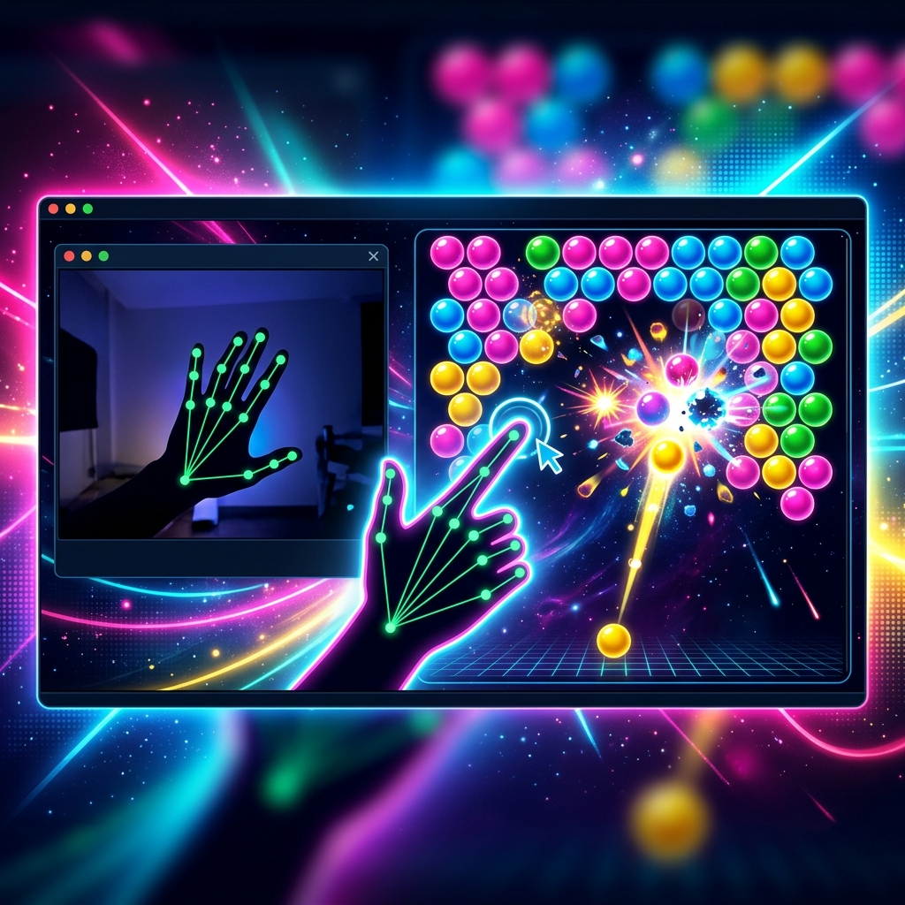

# Baka Gesture Bubble Shooter

<p align="center">
  
</p>

## Overview

A **hands-free, computer-vision-powered** clone of the classic Bubble Shooter game. Players use **hand gestures** captured via webcam to aim and shoot bubbles, leveraging real-time camera feed and physical interactions rendered on an **HTML5 Canvas**. No keyboard or mouse required — just your hands!

---

## Key Features

- **Gesture-controlled gameplay** — Aim and shoot using hand movements detected via webcam
- **Real-time hand tracking** — MediaPipe-powered hand landmark detection
- **Classic Bubble Shooter mechanics** — Match 3+ same-colored bubbles to pop them
- **HTML5 Canvas rendering** — Smooth, responsive game graphics
- **No external hardware** — Works with any standard webcam

---

## Technology Stack

| Technology | Purpose |
|---|---|
| JavaScript | Game logic and rendering |
| HTML5 Canvas | Game graphics |
| MediaPipe Hands | Real-time hand tracking |
| TensorFlow.js | ML model inference in browser |
| CSS3 | Styling and layout |

---

## How It Works

```text
Webcam Feed
    ↓
MediaPipe Hand Detection
    ↓
Gesture Recognition (aim direction)
    ↓
Canvas Game Engine
    ↓
Bubble Physics & Collision
    ↓
Score Update
```

---

## Installation & Setup

```bash
git clone https://github.com/srivatsacool/baka-gesture-bubble-shooter
cd baka-gesture-bubble-shooter
npx serve .
# Open in browser with webcam access
```

---

## Author

**Srivatsa Gorti**

---
